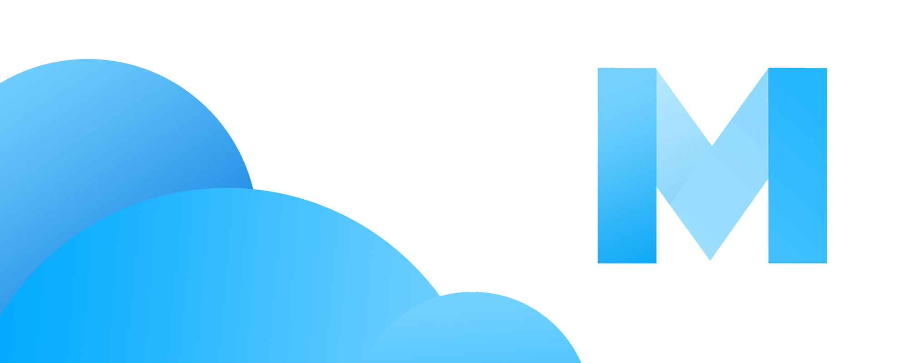

# 🔮 M2 Realtime Messenger

[![Swift Version][swift-image]][swift-url] 

M2 is a realtime messenger that I coded as my bachelor's thesis at the HAW Hamburg in Germany.

The basic concept behind digital conversation has remained unchanged for some time now.
Messages are often sent while the other person does not require active presence.
This can be useful, but it creates an impersonal kind of communication.
This work will deal with the development and implementation of an innovative concept
for messaging on the mobile platform iOS that focuses on the opposite side of the conversation
and draws the user’s attention to the conversation.

## 🛠 Requirements

- iOS 12.0+
- Xcode 10

[swift-image]:https://img.shields.io/badge/swift-5.0-orange.svg
[swift-url]: https://swift.org/